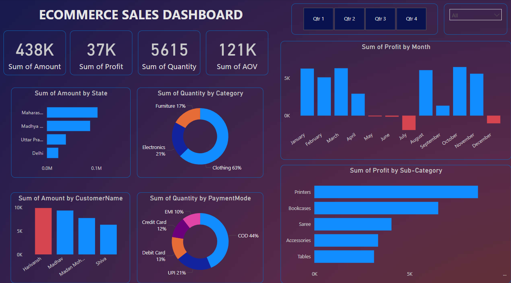

# 📊 E-commerce Sales Dashboard  

This repository contains an **interactive Power BI dashboard** designed to analyze **e-commerce sales performance**. The dashboard provides insights into **sales, profit, quantity, and average order value (AOV)** across different states, categories, customers, and payment modes.  

## 🔹 Key Features  
- **KPI Metrics** – Displays total **sales, profit, quantity sold, and AOV**.  
- **Sales & Profit Analysis** – Visualizes trends by **month, category, and sub-category**.  
- **Customer Insights** – Identifies top customers and revenue contributions by state.  
- **Payment Mode Breakdown** – Analyzes transactions across different payment methods.  
- **Interactive Filters** – Enables **quarterly and category-based** filtering for deeper insights.  

## 📷 Dashboard Preview  
[E-commerce Sales Dashboard] 

## 📂 Repository Contents  
- `Dashboard.pbix` – Power BI dashboard file.  
- `Dataset/` – Source data used for visualization.  
- `Screenshots/` – Previews of the dashboard visuals.  

## 🚀 Getting Started  
1. **Install Power BI Desktop** (if not already installed).  
2. Clone this repository:  
   ```sh
   git clone [https://github.com/yourusername/your-repo.git](https://github.com/ashok141997/ECOMMERCE-SALES-DASHBOARD/blob/main/SalesM.pbix)
